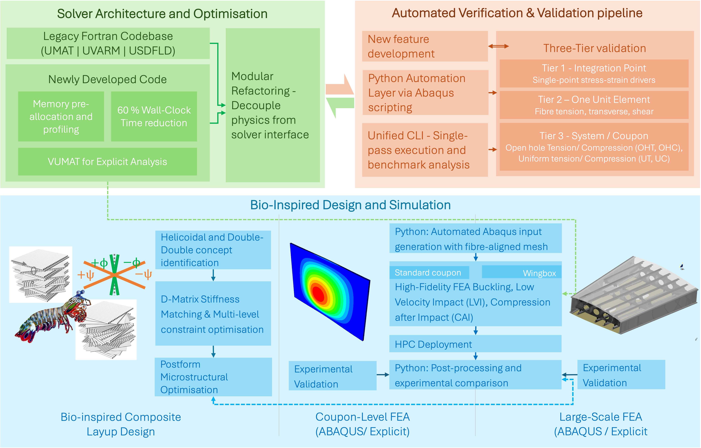

# Imperial College London — Research Associate (Simulation & Computational Modelling)
*Collaboration: Spirit AeroSystems & Airbus*  
*Nov 2024 – Present*

---

## Overview
This project develops predictive simulation tools for composite aerospace structures.  
The goal is to build reliable numerical models that can both reproduce experimental behaviour and guide structural design decisions.

The work spans three connected parts:
1. Building a reusable simulation framework
2. Validating models against physics and experiments
3. Using the model to search for improved structural designs

![Flowchart]

  

---

## 1. Software Architecture & Numerical Framework

### Modular Solver Architecture
A legacy research codebase consisted of independent Abaqus subroutines (UMAT, UVARM, USDFLD) with duplicated physics logic.

I redesigned the structure into a modular library and implemented a VUMAT for explicit dynamics.

**Key idea:** separate *material physics* from *solver interface*

This enabled:
- single-source implementation of material behaviour
- easier feature extension
- consistent behaviour across solvers

---

### Performance Optimisation
Profiling revealed most runtime occurred inside the integration-point update loop.

Optimisations included:
- memory pre-allocation
- removal of repeated allocations
- restructuring variable updates
- reducing function call overhead

**Result:** ~60% reduction in simulation runtime  
(no change to underlying equations)

---

## 2. Automated Verification & Validation

To ensure model correctness, I developed an automated Python testing pipeline connected to Abaqus.

### Automated FEA Pipeline
- automatic model generation
- fibre-aligned mesh construction
- parameter injection
- batch execution

---

### Three-Tier Validation Strategy

#### Integration-Point Level
Verify theoretical constitutive behaviour along prescribed stress-strain paths.

Purpose: confirm equations are implemented correctly.

#### Element Level
Single-element simulations under:
- fibre tension
- transverse tension
- shear
- compression

Purpose: verify directional response and damage activation.

#### Coupon Level
Compare against experimental benchmarks:
- OHT — Open Hole Tension
- OHC — Open Hole Compression
- UT — Uniform Tension
- UC — Uniform Compression

Purpose: confirm predictive capability.

---

### Continuous Testing Interface
A command-line interface executes:
- single tests (for development)
- full regression suite (for validation)

The pipeline automatically compares results with stored benchmarks to detect:
- numerical instability
- unintended behavioural changes

---

## 3. Structural Design & Numerical Optimisation

### Bio-Inspired Laminate Design
A constrained search was implemented to identify laminate configurations matching target stiffness (D-matrix) while improving strength.

Explored architectures:
- Helicoidal
- Double-Double (DD)

Constraint:
> maintain baseline structural stiffness

Method:
- parameterised stacking sequence
- constraint filtering
- simulation validation

---

### Damage Modelling & Simulation
Using the LaRC05 damage model, simulations were performed for:

- buckling
- low-velocity impact (LVI)
- compression after impact (CAI)

Model parameters and numerical stability were tuned via:
- mesh strategy
- integration schemes
- hourglass control

---

### Validated Design Improvement
Combined experimental and simulation results showed:

**≈ 6% strength improvement**  
while preserving weight and stability constraints

This demonstrates predictive capability rather than post-hoc fitting.

---

## 4. Large-Scale Simulation Deployment
To run structural sub-component models:

- generated Abaqus input files programmatically
- automated HPC submission
- batch post-processing

Applied to:
- wing-box substructures
- stringer run-out models

---

## 5. Project Responsibilities
- technical lead (Imperial side)
- coordinated academic–industry collaboration
- supervised PhD researchers
- maintained simulation framework integrity

---

## Key Takeaways
This work focuses on building models that are:

- **physically valid** (verified against theory)
- **predictive** (validated against experiments)
- **usable** (automated and extensible)
- **efficient** (optimised runtime)

The resulting framework supports both engineering analysis and design exploration.
