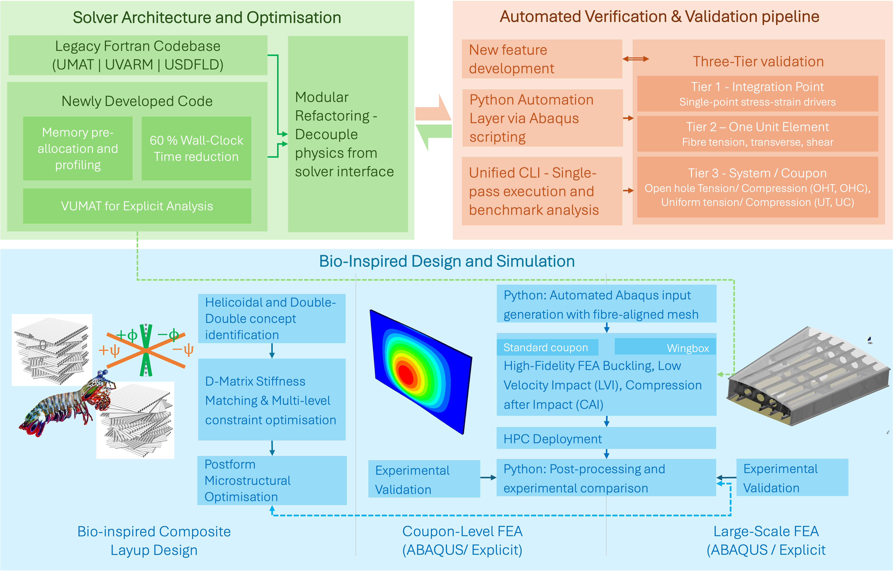

# Imperial College London — Research Associate

**Industry Partners:** Short Brothers (Spirit AeroSystems, ATI Project) & Airbus  
Research Associate, Simulation & Computational Modelling Engineer  
London, UK  
Nov. 2024 – present

Nonlinear material modelling, automated validation pipelines, and bio-inspired structural design for composite aerospace structures.

  

---

## Software Architecture & Framework Development

- **Modularization of Legacy Solver Architecture:** Architected a modular library for Fortran-based finite element subroutines (UMAT, UVARM, USDFLD) and engineered a VUMAT subroutine for explicit dynamics. This structural overhaul decoupled core material physics (based on the LaRC05 damage model) from solver interfaces, establishing a "plug-and-play" environment that facilitates rapid feature prototyping and long-term code extensibility.
- **Low-Level Memory & Computational Optimisation:** Performed deep-tier profiling and refactoring of the VUMAT subroutine's variable assignment and memory allocation logic. By implementing a memory pre-allocation strategy for homogeneous test cases, optimised the trade-off between memory overhead and CPU cycles, achieving a **60% reduction in simulation wall-clock time** compared to the legacy implementation.

## Automated Verification & Validation (V&V)

- **Scripted FEA Pipeline:** Developed a Python-driven automation layer for Abaqus to handle complex model generation, including fibre-aligned mesh synthesis and dynamic parameter updates.
- **Three-Tier Automated Testing Framework:** Engineered a robust Python testing pipeline to ensure algorithmic integrity across scales:
  - **Integration Point Level:** Automated "single-point" test drivers to validate new constitutive features against theoretical stress-strain paths.
  - **Unit/Element Level:** Automated single-element verification to audit material responses across primary loading modes (fibre/transverse tension, shear).
  - **System/Coupon Level:** Automated validation against industry-standard physical benchmarks, including Open Hole Tension (OHT), Open Hole Compression (OHC), Uniform Tension (UT), and Uniform Compression (UC).
  - Implemented a unified **Command-Line Interface (CLI)** that executes either the single or full testing suites in a single pass, performing automated analysis against benchmarks to maintain code integrity during development cycles.

## Structural Design & Numerical Optimisation

- **Bio-inspired Layup Optimisation:** Developed a Python-based optimisation script to identify "D-matrix" stiffness matching for bio-inspired Helicoidal and Double-Double (DD) composite architectures, utilising multi-level constraint satisfaction to match baseline structural invariants.
- **Advanced Damage Modelling:** Conducted high-fidelity FEA using the LaRC05 damage model to simulate non-linear responses including buckling, Low-Velocity Impact (LVI), and Compression After Impact (CAI).
- **Algorithmic Refinement:** Optimised simulation accuracy and stability by tuning mesh strategies, integration schemes, and hourglass control algorithms.
- **Validated Performance Gains:** Demonstrated through correlated experimental and numerical data a **6% increment in mechanical properties** for novel helicoidal designs while maintaining strict weight and stability parity with industry baselines.
- **Large-Scale Simulation Deployment:** Engineered automation scripts for the generation and submission of massive Abaqus input files (wingbox sub-structures and stringer run-outs) to High-Performance Computing (HPC) clusters.
- **Project & Team Management:** Acted as the technical lead for the Imperial branch of the ATI project; managed cross-team communication, financial planning, and technical deliverables. Supervised two PhD candidates in algorithm development and computational mechanics.

---

[Back to main page](../README.md)
