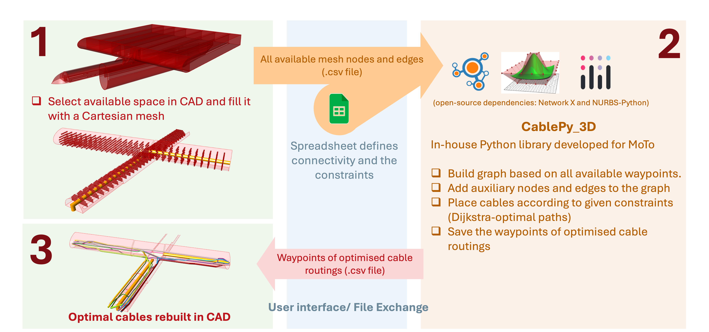
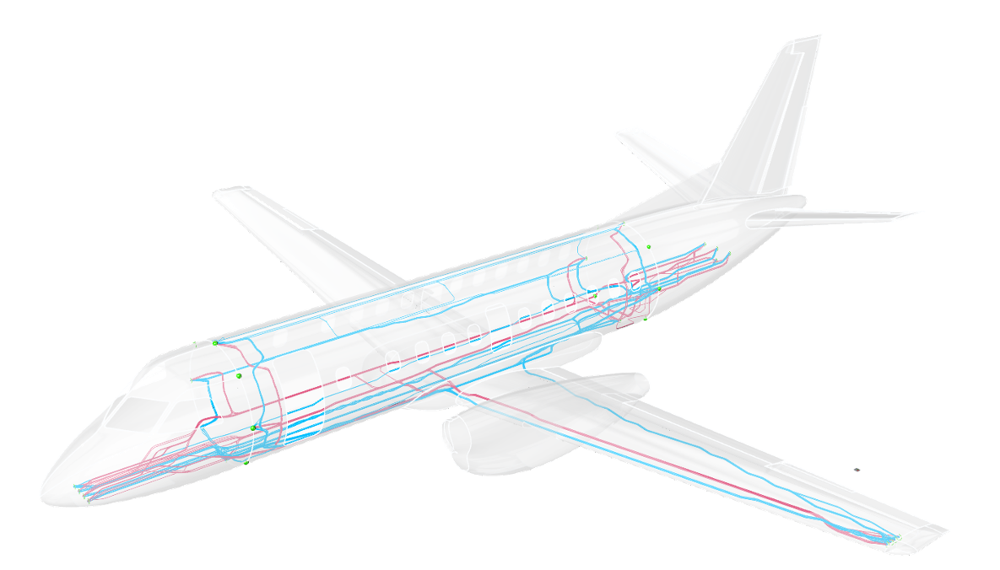
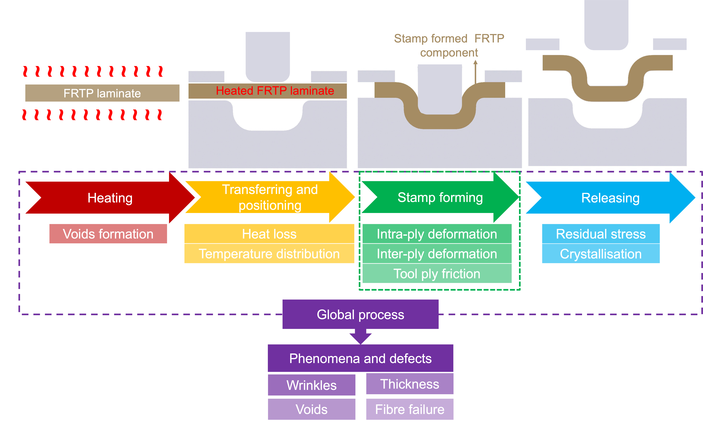
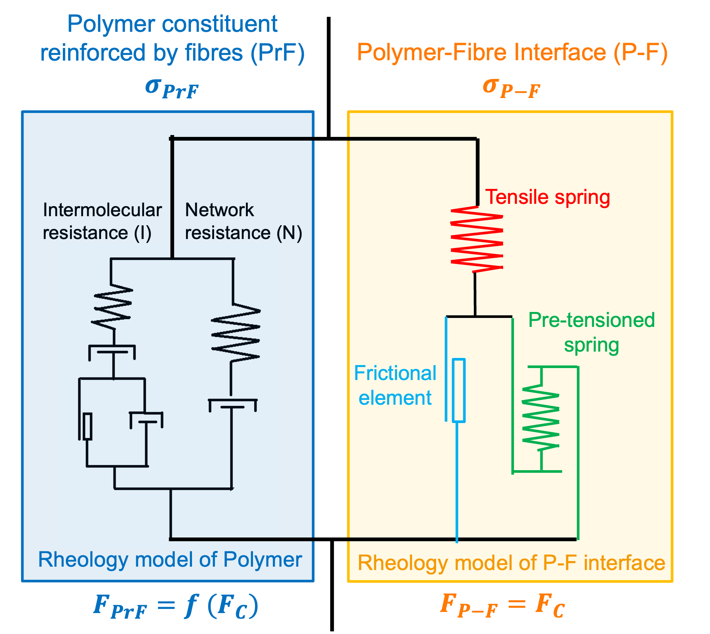

# Yvonne Wang (Hongyan Wang)

Computational modelling and optimisation researcher specialising in mathematical modelling, validation, and constrained search for complex real-world systems.  
🔗 **[LinkedIn](https://www.linkedin.com/in/hongyan-wang18/)**  
📧 hongyan.wang118@gmail.com  
📍 London, UK  

---

## Professional Experience

### Imperial College London | Short Brothers (Spirit AeroSystems, ATI Project) & Airbus
🏙️ London, UK  
👩‍⚕️ Research Associate, Simulation & Computational Modelling Engineer  
🗓️ Nov. 2024 – present

Nonlinear material modelling, automated validation pipelines, and inverse structural design.

![Flowchart]

  

➡️ [Detailed description](Imperial_College_London_RA/ImperialCollegeLondon_RA.md)

---

### University of Southampton | Airbus 
🏙️ Southampton, UK      
👩‍⚕️ Research Associate, Digital Design Engineer      
🗓️ Nov. 2023 – Nov. 2024        

Graph-based routing and combinatorial optimisation for automated aircraft cable layout.

![Flowchart]

  

![Demo]

  

➡️ [Detailed description](University_of_Southampton_RA/University_of_Southampton_RA.md)

---

### Imperial College London — PhD Research
🏙️ London, UK
👩‍⚕️ Postgraduate Researcher in Computational Modelling of Material Processing
🗓️ Oct. 2018 – July 2023

Predictive modelling of material behaviour and manufacturing process optimisation validated experimentally.

**Flowchart**
![Flowchart]

  

**Model Structure**
![ModelStructure]

  

**Subroutine Structure**
![SubroutineStructure]

  

➡️ [Detailed description](Imperial_College_London_phd/phd.md)

---

### Lloyds Banking Group — Credit Risk Data Science Project
Loan default prediction using machine learning models and statistical evaluation.

➡️ [View repository](https://github.com/Hongyan-Wang/LLoydsBankingGroup_CareerChallenge)

---

## Education

**Ph.D. Mechanical Engineering** — Imperial College London (2018–2023)  
**M.Sc. Materials Science & Engineering** — Shanghai Jiao Tong University (Top 10%)  
**B.Sc. Materials Science & Engineering** — Huazhong University of Science and Technology (Top 2%)

---

## Publications
[Full list](https://scholar.google.com/citations?hl=en&user=eeg-D8QAAAAJ&view_op=list_works&authuser=1)

**Publications**
1. H. Wang, E. Kazemi, S. T. Pinho, 2025, Finite element analysis (FEA) of bio-inspired helicoid carbon fibre-reinforced polymers (CFRPs) under open-hole tension and compression. The 10th ECCOMAS Thematic Conference on the Mechanical Response of Composite. Vienna, Austria.  
2. H. Wang, A. Sobestor, 2024, Modelling of Tomorrow -- First steps towards an automated. 
cabling framework. Physical Workshop Decision Making & Optimization, Toulous, France.     
3. H. Wang, H. Liu, Z. Ding, N. Li, Experimental and constitutive modelling studies of semicrystalline thermoplastics under solid-state stamp forming conditions. Polymer, 2021. 228: p. 123939. https://doi.org/10.1016/j.polymer.2021.123939. 
4. H. Wang, Z. Ding, X. Chen, H. Liu, N. Li, Experimental characterisation and constitutive modelling of the intra-ply tensile and shear properties of unidirectional fibre reinforced thermoplastics (UD FRTPs) under solid-state stamp forming conditions. Composites Part A: Applied Science and Manufacturing 179 (2024): 108034. https://doi.org/10.1016/j.compositesa.2024.108034. 
5. H. Wang, Z. Ding, Z. Shao, H. Liu, N. Li, Error analysis of stress-strain characterisation using V-Notched Rail shear test for sheet materials subject to large simple shear deformation. Submitted to International Journal of Mechanical Sciences, 2023. Under review. Preprint preview: https://doi.org/10.31224/2340. 
6. Z. Ding, H. R. Attar, H. Wang, et al., Integrating Convolutional Neural Network and constitutive Model for Rapid Prediction of Stress-Strain Curves in Fibre Reinforced Polymers: A Generalisable Approach, Materials & Design, 241, 112849. https://doi.org/10.1016/j.matdes.2024.112849. 
7. Z. Ding, H. Wang, J. Luo, N. Li., A review on forming technologies of fibre metal laminates. International Journal of Lightweight Materials and Manufacture, 2021. 4(1): p. 110-126. https://doi.org/10.1016/j.ijlmm.2020.06.006
8. R.A. Brooks, H. Wang, Z. Ding, et al., A review on stamp forming of continuous fibre-reinforced thermoplastics. International Journal of Lightweight Materials and Manufacture, 2022. 5(3): p. 411-430. https://doi.org/10.1016/j.ijlmm.2022.05.001. 

**Filed Patent**
1. Z. Ding, N. Li, H. Wang, et al, A method of forming metal alloys and fibre-reinforced polymers in one-shot stamping, 2024 (P79563GB, filed on December 2024).  
2. H. Wang, N. Li, Z. Ding, et al., A novel process for forming carbon fibre reinforced polymer matrix composites (CF-PMCs) involving induction heating, 2024 (Disclosed to Imperial IPC team).  

---

## Skills

**Programming:** Python, Fortran, MATLAB, C/C++  
**Algorithms:** optimisation, graph search (A*, Dijkstra), genetic algorithms, constraint modelling  
**Modelling:** parameter inference, numerical simulation, validation against data  
**Libraries:** NumPy, Pandas, SciPy, scikit-learn, NetworkX, Plotly, Dash  
**Engineering Tools:** Rihno/Grasshopper, Abaqus, HPC workflows

---

## Interests
Hiking • Swimming • Digital art • Classical music • Literature & theatre

---
